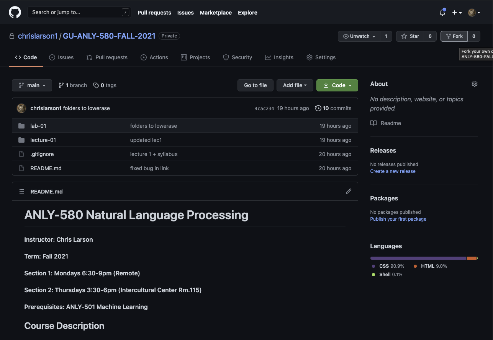

# Github Setup

This course will be conducted primarily through Github. Materials will be posted to Canvas, but please treat *this* repository as your single source of truth, with the syllabus (README.md) as your starting point. It will contain up-to-date links to all lectures, labs, assignments, exams, and reading material. To submit assignments, exams, and projects, each student will create a private fork of this repository and then add the instructor as a *collaborator*. Please follow the instructions below to get setup. If you are a Windows user, it is highly recommended that you install VirtualBox and interact with this course on a unix based OS; all examples involving shell commands are unix specific. Also note that these instructions are specific to those running MacOS; it is assumed that if you're running Linux you can translate these instructions to your specific distribution (contact the instructor if you need assistance).

1. Determine if you have brew installed

    	$ brew --version

    If this results in an error you will need to install it (step 2). If the above command returns a version, skip to step 3.

2. Install Homebrew (MacOS package manager):

    	$ /bin/bash -c "$(curl -fsSL https://raw.githubusercontent.com/Homebrew/install/HEAD/install.sh)"

3. Install git via Homebrew

    	$ brew update && brew install git
    	
4. Create a Github account (if you don't already have one) <a href="https://github.com/login">here</a>

5. Email the <a href="chris.larson@georgetown.edu">instructor</a> with your Github user handle to request access to the course repository. You will recieve a confirmation email when you've been granted access.

6. Login to GitHub in a web browser and fork [this repository](https://github.com/chrislarson1/GU-ANLY-580-FALL-2021.git). This can be done by clicking the *fork* button located in the top-right corner of the page (see below).

	

	
	

7. Give the instructor access to your fork by navigating to your fork on the github website and then clicking `Settings -> Manage Access -> Invite a Collaborator` and adding `chrislarson1`. 

8. Create a local directory for the course, replacing `<your-github-handle>` in the snippet below with your Github user handle:

    	$ cd ~/Documents && git clone https://github.com/<your-github-handle>/GU-ANLY-580-FALL-2021.git && cd GU-ANLY-580-FALL-2021

8. Git allows you to define multiple *remote* sources, to/from which you can push/pull changes. The `git clone ...` command in step 7 automatically created a remote called `origin`. The `origin` remote will remain pointed at your fork. Now create a remote called `upstream` and point it at the main course repository. This will allow you to pull new content as it becomes available throughout the semester. 

    	$ git remote add upstream https://github.com/chrislarson1/GU-ANLY-580-FALL-2021.git	

9. Confirm that you have created the upstream remote

    	$ git remote --v
# 
##  Syncing your fork

New material will be added to the main repository every week. To sync your fork, run the following command:

	$ git pull upstream && git push origin

#
## Submitting your work

After you've pulled the new content and pushed it to your fork, you can begin completing your coding assignments. To submit files, push the files to your fork using the following flow:

	$ git add <file-to-be-submitted>
	$ git commit -m  "your commit message goes here"
	$ git push origin

#
## Notes

1. The `upstream` remote is read-only, meaning that you should **never** try to push upstream, only pull.

2. Git is primarily meant to be a code versioning system. If you have large data files (100MB+) that accompany assignment or project work submissions, please stick them in a storage bucket (e.g., Box, Google Drive) and provide a link to it's location in the code/notebook that you are submitting.